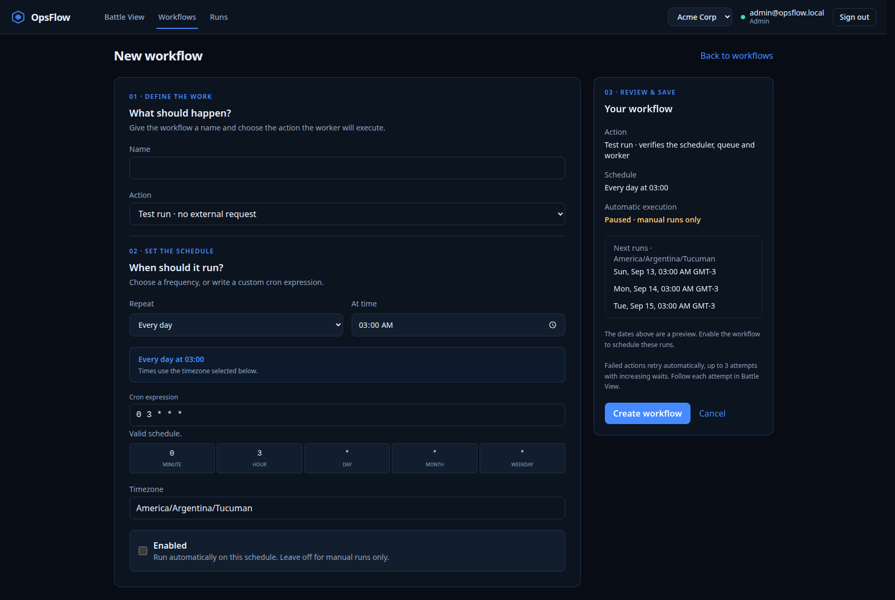
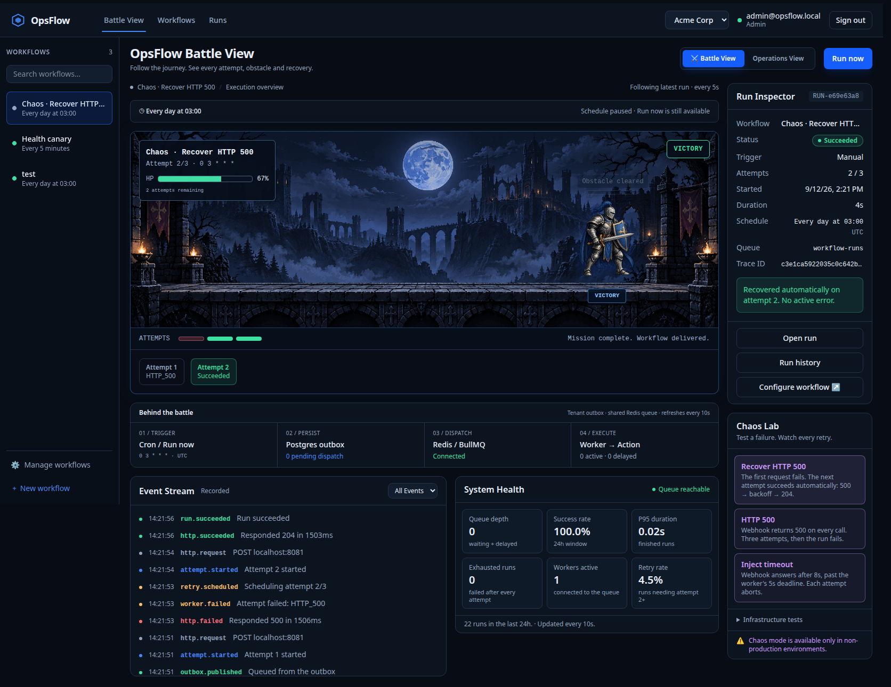
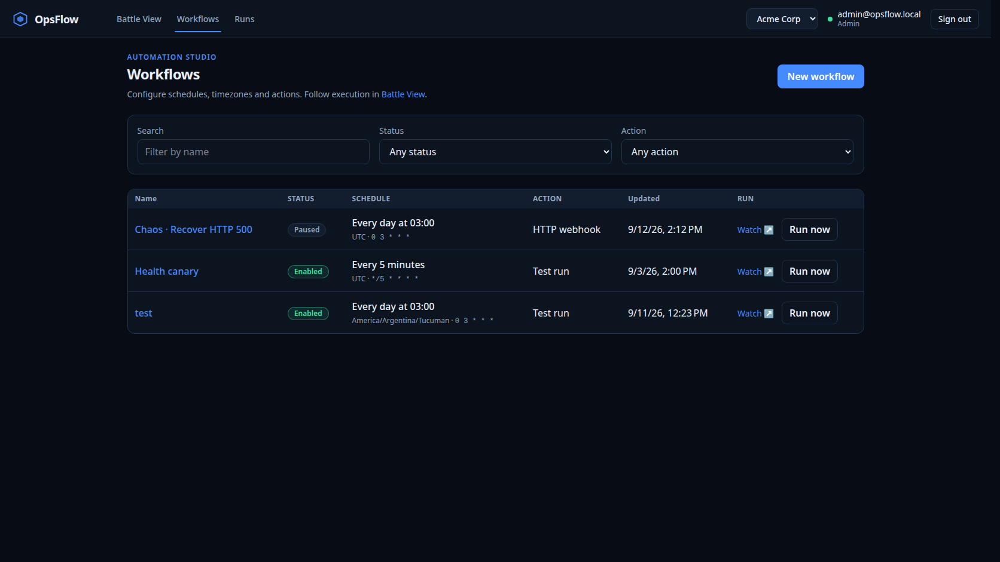
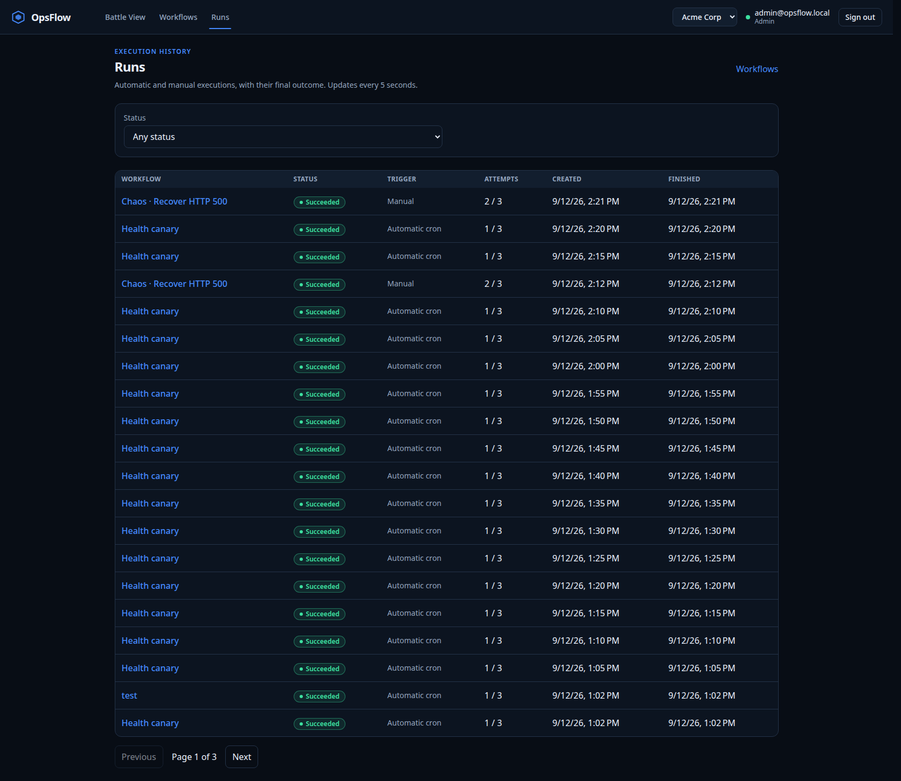
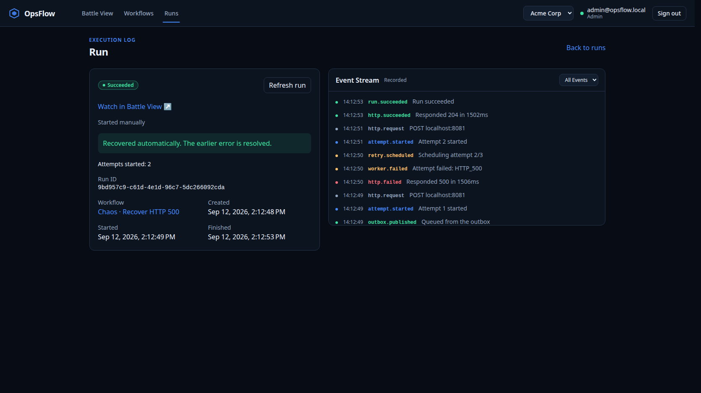

# OpsFlow

Some context first: I'm senior in next, supabase and AWS, but I kept thinking I had angular pending, something halfway interesting to build with it, so I figured, why not do a project to learn how it's used? I took concepts I already knew and brought them over here. Since I already have experience with redis, queues and all that, I set out to build this, a showcase of idempotency, retries, queues and workflows.

> **Disclaimer:** this repo was about learning Angular to a level I'd consider decent. I put the AI to act as a senior and see if it caught anything, but its opinions felt incoherent to me, it contradicted itself across chats and kept raising impossible edge cases.

Anyway, let's go tech by tech and then I'll get to the architecture.

## The tech, one by one

### Nx

I love turborepo, the way it handles dependencies, cache and optimizations is so damn good that it makes me value a monolith there way more than thinking about microservices. Although sometimes microservices are just what you need, and dodging that reality is dumb too.

But while working out the plan with cursor it told me: nope nope, around here we use `nx`. And it was right, because nx isn't just cache: it's the repo orchestrator and it holds the project graph, meaning it decides who can import what.

That last part turned out to be the most valuable thing. Every project carries two tags, `type:` and `scope:`, and a rule enforces them:

- `type:domain` can't import anything. `type:contracts` can only import `domain`.
- `scope:web` can't see `scope:server`, and that's what makes it **literally impossible** for the browser to import typeorm. The lint stops the build.

A detail that took me a while to get: the type axis alone wasn't enough, because `type:app` also covers the angular app. The scope axis is what separates them.

On top of that the generators came with the plugins already set up, so they helped a lot to give the project a good structure from the start.

### Vitest

Not much to say here, it's jest but more optimized, I already had experience so adapting it to angular testing was pretty simple.

The interesting part was having to add a plugin (`@analogjs/vite-plugin-angular`) so it compiles the templates and can actually read them. Without it vitest sees the component's `.ts` but doesn't understand the `.html` sitting next to it.

### Angular 22.1

Okay, this was the whole reason. I picked 22.1 simply because it was the newest. I did it as an SPA, no SSR, so I couldn't use the server components I want so badly, but it made sense since the server was already a separate process.

Beyond the obvious, now I get why people say angular is more organized. In next it depends on having someone mildly annoying about PRs, like me, to keep everything from going sideways; here it feels easier to hold that order. But hey, who knows, if you really set your mind to it you'll probably wreck it anyway.

In general it's easy to understand, it's a matter of getting what each method on the class does. Past that it has some interesting things:

#### Zoneless

This one took me a while. The old model was zone.js patching everything async and then walking the component tree looking for what changed. Zoneless flips the direction: a write to a signal marks dirty whatever depends on that signal, and that's what schedules the render. Nobody guesses, nobody walks more of the tree than they have to. You declare it explicitly with `provideZonelessChangeDetection()` in `app.config.ts`, and it's worth declaring even when zone.js isn't there, so it's written down as a decision.

#### Signals

I got this genuinely wrong, and it's worth telling. At first I thought they were some kind of server cache, tanstack query style, where if the fetch changes it reapplies. Then I thought they were something like zustand. They're neither.

A signal is UI state and nothing else: a value and whoever depends on it. Zustand would give me a client cache that can lie or drift out of sync, which is exactly what I didn't want. For server data angular's answer is something else (`resource` / `httpResource`), and for the rest you just ask again.

I'm still left with an open question though: will this scale to 20 screens consuming the same thing? From what I understand it might, but it doesn't feel as simple as a query cache.

#### Signal Forms

I liked these. It's easier to carry if you start from zero than the typical react hook form: you handle validations and states more easily. And one detail that sold me: a custom control implements `FormValueControl<T>` and that's it, no more `writeValue` / `registerOnChange` / `registerOnTouched` trio from `ControlValueAccessor`. The `CronField` here exposes a `value` and nothing else.

The best part is that validations call the pure functions in `libs/domain` directly, without wrapping them in a `ValidatorFn`. Which means the browser form and the postgres CHECK reject exactly the same things.



The next-runs preview on the right is computed by the same `nextRuns` the scheduler uses, so what the form promises is what the cron will actually do.

### Nest

What a lovely beast, so easy to organize everything, you get validations and the rest just with decorators.

I have to be honest here though: I already had some experience with nest, in fact I taught courses at the university in San José that had an agreement with ApruebaXtreme, back when chatgpt was only just being born, imagine that.

There's no big mystery to Nest, it's Express plus decorators and modules.

### gRPC + proto3

I already had experience with trpc, but it's not the same, I wanted to go literally to this protocol.

Short version: you write a `.proto` describing the messages and the methods, and out of that comes a contract both ends share. Instead of sending text JSON it sends binary over HTTP/2, so it weighs less and parses faster.

But the optimization isn't what matters most here. This is usually used in microservices or in monorepos with several servers because it gives you a command layer the browser flat out can't call: `runtime-v1.proto` exposes `RunNow`, `CancelRun`, `RetryRun` and `GetRuntimeHealth`, and that lives on the orchestrator's `:50051`, which isn't published outward.

Question: could I have just used http and called it a day? Of course, for two services on the same machine this is over-engineering. I picked it anyway for the boundary: it leaves a command layer the browser can't reach.

### TypeORM

This is where the positivity ends. What an ugly tool. It generates ugly code, the SQL would be painful to write by hand without an agent.

And it's not just aesthetics, I ran into two concrete things:

1. I ended up writing the migrations by hand because `migration:generate` doesn't faithfully reproduce the partial indexes or the CHECKs this schema needs. So the tool that exists to generate migrations for you was no use to me for generating migrations.
2. The CLI runs through `tsx`, which doesn't emit decorator metadata, so a bare `@Column()` has nothing to infer the type from. You have to write `@Column({ type: 'text' })` on every column, always.

I compare it to supabase (declarative schemas, migration handling and the whole ecosystem in general) and I don't understand what this brings that's new or different enough to consider using it. The only thing I can come up with is that it's been around a long time and it's stable, but man, no.

### Postgres 18

Postgres is the king of everything, keep it boring!!.

It did quite a bit more than store rows here though: the CHECKs are generated from the same TypeScript unions the front uses, `SKIP LOCKED` is what holds up the schedulers' concurrency, and the composite foreign keys are what stop a run from pointing at another tenant's workflow.

### Redis + BullMQ

I use upstash day to day, and for queues I go straight to the ones supabase offers, but I have to admit bullmq is incredible. Each worker runs the action snapshot and not the live workflow, and it makes everything easy to configure. Fun fact, I obviously work with agents, and the wild thing about this part is that codex one-shotted it, I just had to validate a couple of small tests and that was that.

But it's wild, because this is what lets you have Outbox + SKIP LOCKED + retries with the same `Idempotency-Key`. At-least-once, not exactly-once, exactly like SQS.

### OpenTelemetry

This one was new. What it does is register a `NodeTracerProvider`, open a span and pass a child `traceparent`, which gets injected into whatever protocol you're using, and it logs the `traceId`, the `spanId`, the `durationMs` and the `errorCode`.

Make sense? It's basically putting the same id on a request as it crosses the different services. That's kind of hard to see on vercel.

Here the `traceparent` travels explicitly over HTTP, in gRPC metadata and through the outbox, with no magic context manager in the middle. The result is you grab a run in the console, copy its trace id and see the four pipeline stages under the same id. And one small decision I'm happy about: error logs carry the `errorCode` (the class name) and never the message, so SQL parameters and webhook credentials don't end up in stdout.

### What I won't pretend is news

Anyway, I'm not going to talk about docker, oxlint or playwright because those are things I'd had working for a long time already, same with husky and github actions. There's not much point treating them as news.

## The architecture

### The four processes

Four processes running separately:

| Process | Port | What it handles |
| --- | --- | --- |
| Angular console | `4200` | The UI, and the only thing the user sees |
| API (Nest) | `3100` | REST, sessions, roles, audit and the SSE |
| Orchestrator (Nest) | `3101` + gRPC `50051` | The cron, the internal commands and outbox publication |
| Worker (Nest) | `3102` | Runs the actions and does the retries |

The obvious question is why not just put everything in the api and call it a day. The answer is that if the action runs inside the request, the client timeout kills your work halfway through, and if the user refreshes the page, you lost. So the api only accepts the command and answers "ok, got it", and from there on the one executing is another process that doesn't even know a request ever existed.

Ports are one per service (`API_PORT`, `ORCHESTRATOR_PORT`, `WORKER_PORT`) and never a shared `PORT`, because with four processes side by side a single `PORT` either collides on bind or quietly points your tooling at the wrong service.

### The path of a run

The orchestrator holds the cron and exposes the internal gRPC. Every 30 seconds it sweeps the workflows that are due and claims them with `SELECT ... FOR UPDATE SKIP LOCKED`, which is what lets you run two replicas without both creating the same run.

In that same transaction it writes the run and a row in `execution_outbox` with the action snapshot. Only after that, already outside the transaction, it publishes to redis and marks `published_at`.

And here's the whole point of the pattern: redis can't take part in postgres's commit. There's no two-phase commit between them. So the commit **is** the outbox row, and publishing is a separate step that can fail and be retried. If redis is down the row stays there and the next sweep picks it up.

The worker consumes the queue and runs the snapshot, not the live workflow. This matters more than it looks: if somebody edits the workflow while the run is in flight, the run keeps doing what it said when it started and not what it says now.

### The libs and the boundaries

- `domain` depends on nothing. Pure TypeScript: cron rules, actions, and the run status transition table. `RUN_TRANSITIONS` is the machine, and both the TypeScript predicates and the SQL `CASE` are projected from it, so they can't disagree.
- `contracts` are the types that cross processes, plus the `.proto`. It can only depend on `domain`.
- `persistence` and `observability` are `scope:server`.
- `ui` is `scope:web`, and a component earns its place there only if two screens use it.

### Tenants and roles

I went explicit with tenants on purpose: every operation takes a `TenantContext` as an argument, and there's no `AsyncLocalStorage` and no default tenant. It's more verbose, sure, but two concurrent requests have nowhere to mix, because there's no shared slot to mix in.

The `x-tenant-id` header picks a membership, not an identity. Roles (`admin`, `operator`, `viewer`) live in `domain` and get re-checked at the edge, both over HTTP and over gRPC.

### State in the console

For a run's status I used SSE. The api reads postgres once per second per viewer and sends the whole `RunDto`, so it's a view of the current state and not an event log. I considered an in-memory bus or `LISTEN/NOTIFY` and left it for when there are enough viewers to make it worth it: polling the source of truth sees whatever any worker replica writes, without keeping a second delivery path.

What is append-only is `run_events`. Each service records what it did at the moment it did it, with its trace id next to it, and the console replays that afterwards.

The difference with deriving the story from the run's current row is that the row lies to you by omission: when a run retries and succeeds it clears its `error_message`, and the 500 it took two attempts ago disappears. The event doesn't.

## What ended up working

This is the part that cost me the most and the one I'm happiest with, because it's the stuff you can't see in a screenshot.

**Two schedulers don't duplicate work.** There's an integration test that spins up two replicas against the same postgres and checks that a single run is created, and that after downtime they resume forward instead of backfilling every missed tick.

**The outbox survives redis going down.** If publishing fails, the row stays claimable and the next sweep retries it with the same snapshot and the same run id. If the process dies right between redis accepting and the ack being written, it republishes after 30 seconds. Hence the at-least-once.

**A late worker can't stomp a run.** The update condition carries an `attempt <` fence: the first one to raise the attempt wins and the late replica is a no-op.

**The integration tests run against a real postgres** with Testcontainers, not against a mock. They check schema parity (that the migration and the `EntitySchema` say the same thing), a full rollback down to empty and forward again, tenant isolation, and what happens when a transaction fails halfway.

**The e2e break things for real.** The chaos lab injects a real failure against the webhook sink and the test follows the whole recovery through the browser, collecting real OTLP exports and verifying HTTP → gRPC → queue → the worker's three attempts under the same trace id.

**CI checks the boundaries, not me.** `pnpm boundaries` is an ESLint target that exists for a single rule, `@nx/enforce-module-boundaries`. Everything else in the lint is oxlint. If somebody tries to import typeorm from the console, it doesn't compile.

And there's retention: finished runs get purged past a configurable window, in the same scheduler sweep, dragging along everything hanging off them but respecting a retry's ancestors until their descendants expire.

## How to run it

```bash
pnpm install
pnpm infra:up          # postgres + redis + wiremock
pnpm db:setup          # migrate + seed
pnpm dev               # web :4200, api :3100, orchestrator :3101, worker :3102
```

Go to [localhost:4200](http://localhost:4200) and pick admin, operator or viewer in the identity selector.

To verify:

```bash
pnpm check         # lint, boundaries, types, unit tests and builds
pnpm integration   # real postgres in Testcontainers
pnpm e2e           # live services and flows in chromium
pnpm verify        # all three, which is what CI runs
```

## The visual layer

On top of all that I built myself a view that draws the run like a fight. The HP is the attempts it has left and the enemy is whatever it actually collided with, taken from the events the worker recorded.



That screenshot is a real recovery: attempt 1 came back HTTP_500, attempt 2 got a 204, and the run finished green without anybody touching it. The attempt strip under the arena keeps both, so the failure doesn't disappear once it succeeds.

Below it is the stuff that actually matters. The "Behind the battle" row maps the four pipeline stages with live numbers, so you can watch `0 pending dispatch` climb while redis is down and drain when it comes back. The event stream is what each service recorded, in order. System health is the tenant's real numbers, and anything it can't measure right now says so instead of drawing a zero.

The right rail is the chaos lab, which breaks things for real against the webhook sink: a 500 that recovers on its own on the second attempt, a permanent 500 that burns all three, and a timeout that answers after 8s against the worker's 5s deadline.

The same screen has a toggle to an operations view, which is exactly the same thing without sprites.







Honestly, none of this was necessary. The backend already explained itself with the operations view, and the whole arena and sprites part is decoration on top of data that already existed. I did it because it entertained me and because I wanted to get my hands on a bit more angular UI.

It was good practice and let me poke at a few things.

If I had to do this for real I'd use vercel workflows, which has its differences but could be used for the same thing. Cursor reckons admitting that makes me look worse, but I don't agree, I think there's more value in admitting this was only a proof of concept about new tech I wanted to learn.

If you read all of this, seriously, much love.
