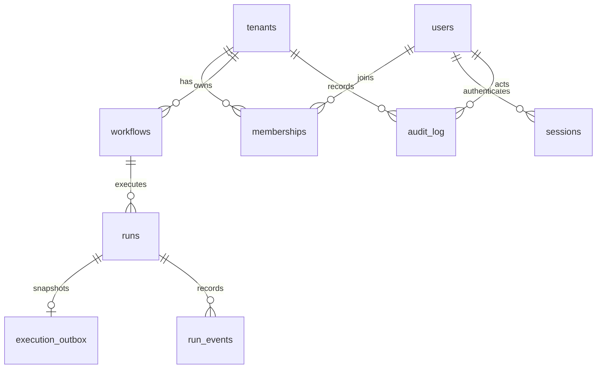

# `@opsflow/persistence`

PostgreSQL + TypeORM. Server-only; Angular imports wire types from `@opsflow/contracts`.

| Location | Responsibility |
| --- | --- |
| [`src/schema/`](src/schema/) | Current model: one TypeORM `EntitySchema` per table, with columns, keys and checks |
| [`src/migrations/`](src/migrations/) | Ordered history of database changes; applied migrations stay unchanged |
| [`src/repositories/`](src/repositories/) | Queries and transactions, with explicit tenant arguments |
| [`src/repositories/retention.repository.ts`](src/repositories/retention.repository.ts) | Opt-in purge of terminal runs and audit entries; the one query with no tenant argument |
| [`src/database/`](src/database/) | Shared connection options, Nest providers and readiness |
| [`src/seeds/`](src/seeds/) | Idempotent demo data, inserted in one transaction |
| [`src/data-source.ts`](src/data-source.ts), [`src/seed.ts`](src/seed.ts) | CLI entry points |

Schemas use TypeORM's native [EntitySchema](https://typeorm.io/docs/entity/separating-entity-definition/).
They describe the current model, and migrations are the only way to change the database.
`synchronize` and `migrationsRun` are disabled. Expression indexes and descending index
order stay as SQL in migrations, with their definitions noted beside the schema's index entries.
The integration suite checks table and column coverage, types, nullability, keys, constraint
names, migration upgrades and rollback. It also exercises tenant isolation and transactional
failures.

## Tenants and access

A tenant is an organization. A user can belong to several tenants through memberships,
each with its own role. A session identifies a user; it does not select a tenant or
carry their role.



`run_events` is append-only: the service that did the work writes what happened, and
nothing updates a row afterwards. Its `id` is a `bigserial` so a reader resumes from a
cursor without tie-breaking on a timestamp, and `workflow_id` is read off the run in the
insert itself, so an event can never disagree with the run it belongs to. `trace_id` holds
the OpenTelemetry trace id, not the request id, so a row in the console and a span in the
collector are the same lookup. It stores codes (`HTTP_500`, `TIMEOUT`) and a short
non-sensitive `detail` such as `POST api.stripe.com` — never a URL with a query string and
never a raw error message, both of which can carry credentials.

HTTP requires `x-tenant-id`. Middleware parses it, `TenantGuard` validates the session,
membership and `@Permit` permission, then `@CurrentTenant()` supplies the verified
`TenantContext` from `@opsflow/contracts`. There is no default tenant and no ambient
`AsyncLocalStorage` state.

```ts
const context = { tenantId, actorId, traceId };
const workflow = await workflows.findById(context, workflowId);
const run = await runs.create(context, workflow.id);
```

Services and repositories pass this object explicitly. gRPC verifies the actor's membership
before constructing it; workers take the tenant from the queued execution. Audit writes
use the same context and the same transaction as the mutation. PostgreSQL composite foreign
keys keep workflow, run, outbox and retry references inside their tenant. ORM filters reject
`undefined` and `null` rather than quietly dropping them.

Writes take a `WorkflowWrite` (`Action` from `@opsflow/domain`). Reads return the public
DTOs in `@opsflow/contracts`. There is one read model. Authorization belongs at the
HTTP/gRPC boundary; repositories enforce scope, and know nothing about roles.

`SchedulerRepository` is the one repository that crosses tenants on purpose, because the
scheduler has to see every tenant's due workflows. It locks them, advances schedules and
writes runs plus action snapshots atomically. [ADR-0003](../../docs/adr/0003-scheduling.md)
covers the claim, publish and ack sequence and why the outbox exists at all. The barrel
exports repositories, `WorkflowWrite` and errors, keeping schemas and `DataSource` internal.

## Changing the database

1. Update the affected definition in `src/schema/` and its row type in `schema.types.ts`.
2. Run `pnpm db:migration:create libs/persistence/src/migrations/describe-change`.
3. Write the migration's SQL `up` and `down`, then register its class in `src/migrations/index.ts`.
4. Run `pnpm integration` to verify a clean install, existing-data upgrades and rollback.
5. Review `pnpm db:show`, then apply with `pnpm db:migrate`.

Do not regenerate old migrations from the current schema, and do not edit one that has been
applied. Do not use `migration:generate`: expression indexes and custom SQL need a deliberate
review. Reverting can fail when existing data cannot satisfy the old constraints, in which case
the transaction rolls back instead of discarding those records. Write a forward migration instead.

File names describe the change (`1788953283918-retry-run.ts`). The class `name` is the
TypeORM ledger identity (`RunRetries1788953283918`) and has to stay stable on databases
that already applied it.

| Command | Effect |
| --- | --- |
| `pnpm db:show` | Show applied/pending migrations |
| `pnpm db:migrate` | Apply pending migrations to `DATABASE_URL` |
| `pnpm db:revert` | Revert the last migration; inspect its `down` first |
| `pnpm db:seed` | Insert missing demo tenants, users, memberships and workflows |
| `pnpm db:setup` | Apply migrations and seed; preserves existing data |
| `pnpm infra:reset` | Delete local Docker volumes and recreate infrastructure/data |

The demo seed is separate from migrations, and it is not a production tenant provisioning flow.
See [the wire contract](../contracts/README.md) for sessions, retries, audit and recovery semantics.
See [ADR-0005](../../docs/adr/0005-persistence.md) for why schemas, migrations and queries are split.
